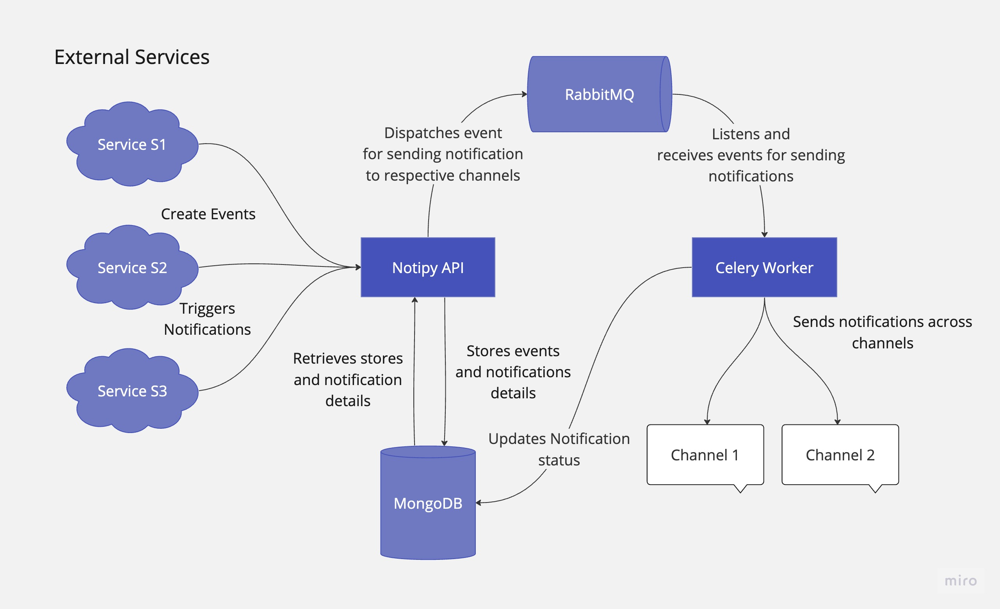

# NotiPy

A multichannel notification system built using FastAPI where users can create events and send notifications with dynamic data to these channels.

## Architecture Overview

<!-- add an image -->

### Components

1. **External Services**: These are the source of events that trigger notifications. The system is capable of handling events from multiple services, identified as Service S1, Service S2, and Service S3 in the diagram.
2. **Notipy API**: Acts as the central processing unit that captures events from external services. It retrieves and stores the notification details for further processing.
3. **RabbitMQ**: This message broker receives events from the Notipy API and queues them to ensure reliable delivery to the next processing stage.
4. **MongoDB**: A NoSQL database that stores the events and notification details, providing persistence.
5. **Celery Worker**: A distributed task queue that listens for queued events from RabbitMQ and handles the job of sending out notifications to different channels and updating status of the notification status in database.
6. **Channels**: The endpoint channels where notifications are finally sent. The architecture supports multiple channels, such as email, SMS, or push notifications, indicated by Channel 1, Channel 2, etc.

### Workflow

- **Event Generation**: External services (S1, S2, S3) create events that may trigger notifications based on the application's logic.
- **Event Capturing**: The Notipy API captures these events and processes them to retrieve and store relevant notification details in MongoDB.
- **Queueing Events**: The captured events are dispatched by Notipy API to RabbitMQ which serves as a message queue, ensuring that the events are processed in an orderly manner without loss.
- **Notification Dispatch**: Celery Worker listens for events from RabbitMQ and, upon receiving them, sends the notifications across the designated channels.
- **Notification Status Tracking**: The Celery Worker updates the status of the notification in MongoDB, indicating whether the notification was successfully sent or not. This status can be used by the Notipy API to resend the notification if required.

## Setup

### Prerequisites

- Docker, Docker Compose

### Steps

- Clone the repository using `git clone https://github.com/vsumit/wareiq-assg`
- Navigate to the project directory using `cd wareiq-assg`
- Run `docker-compose up --build` to build and run the containers
- The API will be available at `http://localhost:8000`
- The documentation will be available at `http://localhost:8000/docs`

## Handy Commands from Makefile

- `make build-and-run`: Build and run the containers
- `make build`: Build the containers
- `make run`: Run the containers
- `make stop`: Stop the containers
- `make clean`: Stop and remove the containers
